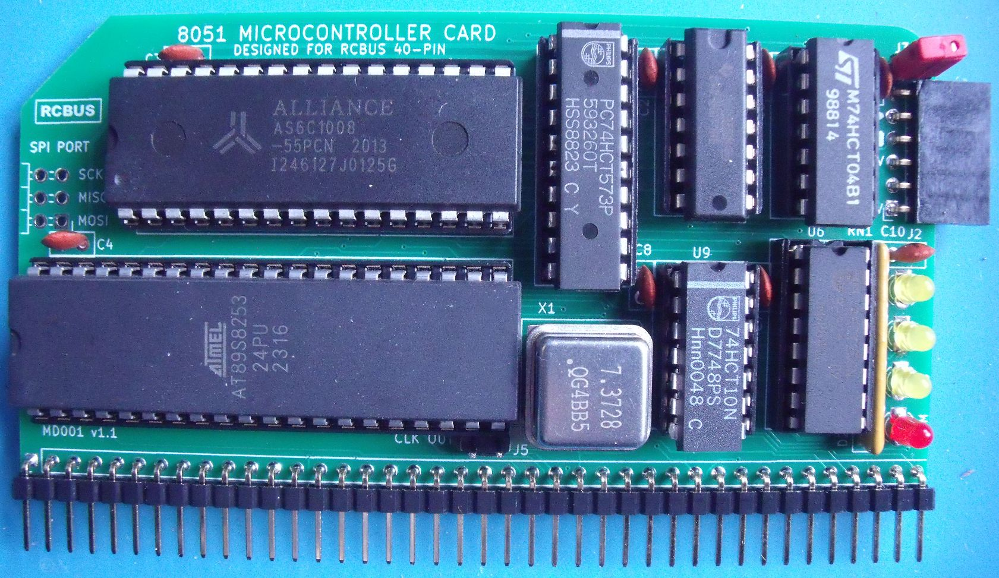
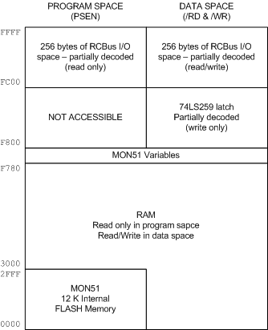

# RCBUS-8051-Board

I've recently re-discovered some of the microprocessors and microcontrollers from my youth via the [RC2014 website](https://rc2014.co.uk/) and the numerous boards available on [Steve Cousins website](https://smallcomputercentral.com/).

The ecosystem is dominated by the Z80 processor and the various Z80 peripheral chips from that era along with the CP/M operating system which the hardware can run.

My introduction to computing started with an 8051 microcontroller and I've got an itch to have a go at putting together an 8051 design that will be compatible with the more open RCBus system. My background isn't hardware so apologies to the hardware designers for the horrors that I'm about to unleash!

# My 8051 RCBus offering
## The 8051 microcontroller
Whilst wanting to retain the retro experience, I wanted to skip the use of a UV eraser - as I don't have one! I initially settled on an ATMEL AT89C51RB2 device as it could be programmed by invoking an interal bootloader and using the free ATMEL FLIP software to program it in-circuit. Version 1 of the board was designed around the AT89C51RB2 device and for the most part it worked - with one HUGE gotcha!

It took me a while to figure it out but after re-reading the datasheet I discovered that there was a fuse bit that prohibited the device from executing code in external memory. The problem was that FLIP can't reprogram this bit to enable external program execution and a parallel programmer was required. My XGecu T48 programmer doesn't support the AT89C51RB2 and I wasn't about to purchase a new PROM programmer just to program this chip.

After searching for a suitable alternative device, I settled on the ATMEL AT89S8253 which is MCS51 compatible.

## External memory
I needed the ability to write to program memory to load code and I wanted to experiment to see if I could come up with a desgin that would be able to switch between the 8051's [Harvard architecture](https://en.wikipedia.org/wiki/Harvard_architecture) (where program memory and data memory are normally separate) and a [von Neumann architecture](https://en.wikipedia.org/wiki/Von_Neumann_architecture).

In order to have the maximum amount of code space and data space, I would need as 128K RAM device.

## The RCBus
The RCBus supports both memory space and IO space. As I was going to have the maximum amout of addressable memory on-board, memory space was not going to be supported. IO space is 256 bytes and is mapped into the data memory map.

# The design (so far...)
The design at v1.1 is shown in the image below. The board is hopefully the size of the RCBus "medium" module with a 40 pin edge connector as detailed in the [RCBus specification](https://smallcomputercentral.com/rcbus/) v1.0.

# Memory Map

After a hard reset, the lower 12K of program memory ($0000..$2FFF) resides inside the AT89S8253 as FLASH memory and the bulk of the 64K block of RAM is shared between program space and data space.

 
# What works
I've ported Dave Dunfields MON51 monitor program over to the 89S8253. Most of the work involved getting the code to assemble using ASEM-51 v1.3 under Windows 10. The modified MON51 (MON51.a51) and original (MON51.ASM) are in the MON51 folder.

* MON51 appears to function correctly
* Program space and data space are shared on power up
* Code can be downloaded via MON51 into the shared RAM and executed
* The on-board latch (74LS259) can be written to ($F800..$FBFF)
* RCBus IO space can be accessed ($FC00..$FFFF)

# Still to do
* Separating program and data space once the code is loaded
* Further checks on the RCBus IO space using a few of Steve Cousins boards
